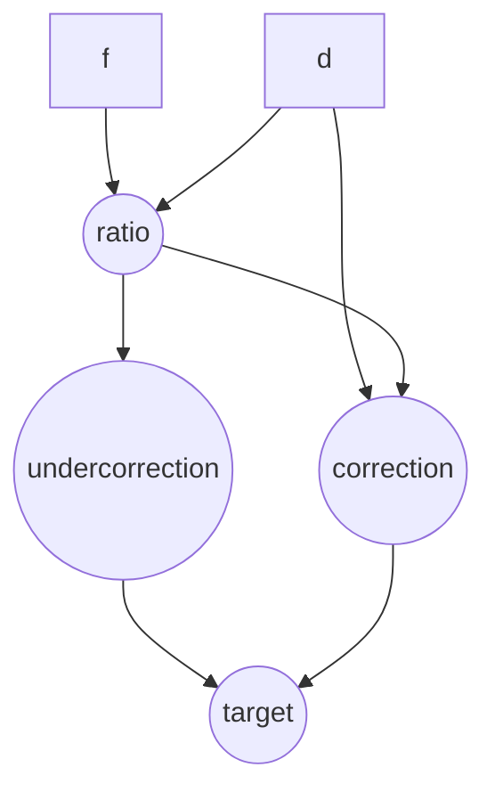

In [a previous post](/blog/computed-properties-in-liveview), I've shown how I thought computed properties could be implemented with pure patterns, without hooking in the Liveview runtime. I want to introduce another take on that, that gives the impression of reactivity, but keeping the purity that I find manageable.

### Declarative dependency tracking with Computer

Here is Computer, a POC library for declarative computation graphs : https://github.com/Lucassifoni/computer

It forms a declarative, dependency-free reactive computation system. Its goal is to allow small internal utilities, think spreadsheet-like formulas, to be easily built in an Elixir application. It's not bound to LiveView or any specific framework.

```elixir
import Computer.Dsl

pace_cpu = computer "Pace computer" do
  input("time",
    type: :number,
    description: "Your running time in minutes",
    initial: 30
  )

  input("distance",
    type: :number,
    description: "Your running distance in km",
    initial: 10
  )

  val("pace",
    description: "Your running pace in minutes per km",
    type: :number,
    fun: fn %{"time" => time, "distance" => distance} -> time / distance end,
  )
end
```

The little amount of magic I allowed myself to bring here lies in how dependencies are tracked - they're extracted at compile-time from the pattern match in the function head. In this case, "pace" is a derived value from "time" and "distance", so it will change if "time" or "distance" changes. When the Computer struct is progressively built, an internal representation keeps track of dependencies :

```elixir
%Computer.Private{
  dependencies: [{"pace", "time"}, {"pace", "distance"}],
  names: %{
    "time" => :input,
    "distance" => :input,
    "pace" => :val,
  },
  depended_ons: %{"pace" => ["time", "distance"]},
  depended_bys: %{
    "time" => ["pace"],
    "distance" => ["pace"]
  }
},
```

### Using the Computer

Computation happens synchronously when inputs are handled :

```elixir
pace_cpu = Computer.handle_input(pace_cpu, "time", 40)
pace_cpu.values["pace"]
```

And you can of course wrap a computer in a process to process messages from various clients sequentially, or spawn an instance with a small make_instance wrapper. In this case, I chose to always return values from the instance when inputs are handled.

```elixir
{:ok, pid} = Computer.make_instance(pace_cpu)
{:ok, values} = Computer.Instance.handle_input(pid, "time", 40)
values["pace"]
```

In a very basic liveview, we could start a linked instance and use it through its PID, so the computer internal representation is not assigned to the socket.

```elixir
def mount(_params, _session, socket) do
  calc = calculator()
  {:ok, cpu_pid} = Computer.make_instance(calc)
  {:ok, socket |> assign(:cpu, cpu_pid) |> assign(:values, calc.values)}
end

def handle_event("change", %{"_target" => [key]} = params, socket) do
  value = params[key]
  {:ok, values} = Computer.Instance.handle_input(socket.assigns.cpu, key, value)
  {:noreply, socket |> assign(:values, values)}
end
```

Let's look at a more advanced example, from a tiny companion app I develop with friends for mirror making purposes :

```elixir
computer "Baader MPCC Conic calculator" do
  input("d", type: :number, description: "Diameter (mm)", initial: 300)
  input("f", type: :number, description: "Focal length (mm)", initial: 1200)

  val("ratio",
    description: "Focal ratio",
    type: :number,
    fun: fn %{"f" => f, "d" => d} -> f / d end
  )

  val("correction",
    description: "Parabola correction (waves @550nm)",
    type: :number,
    fun: fn %{"d" => d, "ratio" => ratio} -> d / (1.1264 * (ratio * ratio * ratio)) end
  )

  val("undercorrection",
    description: "MPCC S.A. undercorrection (waves @550nm)",
    type: :number,
    fun: fn %{"ratio" => ratio} ->
      c = 4 / ratio
      c * c * c * c * 0.81
    end
  )

  val("target",
    description: "Target conic",
    type: :number,
    fun: fn %{"undercorrection" => under, "correction" => corr} -> -1 - under / corr end
  )
end
```

Here we have a more intricate dependency graph:
- `ratio` depends on `f` and `d`
- `correction` depends on `d` and `ratio`
- `undercorrection` depends on `ratio`
- `target` depends on `undercorrection` and `correction`

So, we can depend on intermediate values to derive other values. We also can visualize the dependency graph :

```elixir
%{mermaid: mermaid_graph} = Computer.Graph.graph(cpu)
```

Which produces something like:



Or, rendered :


Unlike the more manual approaches I've described in [a previous post](/blog/computed-properties-in-liveview) where you had to be the "crank" in the machine and trigger updates to various dependency tracking data structures, this kind of library handles the computation ordering and updates for you.

Since dependencies are extracted at compile time with macros, we do not need any kind of runtime tracing of calls to understand dependencies between values.

The Computer is just another Elixir struct :

```elixir
%Computer{
  name: "ROC Calculator",
  inputs: [
    %Computer.Input{
      name: "curve",
      description: "Curve type",
      type: :select,
      initial_val: "concave",
      options: [{"concave", "Concave"}, {"convex", "Convex"}]
    },
    ...
  ],
  vals: [
    %Computer.Val{
      name: "roc",
      description: "ROC: (r² + s²) / 2s ± b/2",
      type: :number,
      fun: #Function<2.132292295/1 in Computer.Samples.RocCalculator.sample/0>
    }
  ],
  private: %Computer.Private{
    ...
  },
  values: %{
    "b" => 3,
    "curve" => "concave",
    "r" => 40,
    "roc" => 269.6666666666667,
    "s" => 3
  }
}
```

The question, as always, stays the same : do we truly *need* that kind of convenience library ? I would say that this one is convenient for some purposes I have. A lot of things that live in Excel spreadsheets can be relevant or useful "in the field", and augmented with a default way to render inputs and outputs, this kind of utility allows to very quickly build calculation helpers.

But wrapped in a process, I can also think of uses that are UI-less. For example, in the [Nerves Cloud generator](/blog/elixir-nerves-cloud) we built with [Lab212](https://lab212.org), there are a few background calculations that react to ambient and pump-specific sensors. Those could benefit of a readable declaration that both declares and documents the relation between inputs and derived values, since a hardware system benefits from a summary of its interactions with the outside world.

My conclusion, like in the previous liveview post, stays the same : Elixir gives us all of the tools we need to handle data in a lean way, and derived properties or computations might not be needed in UI libraries :-)
